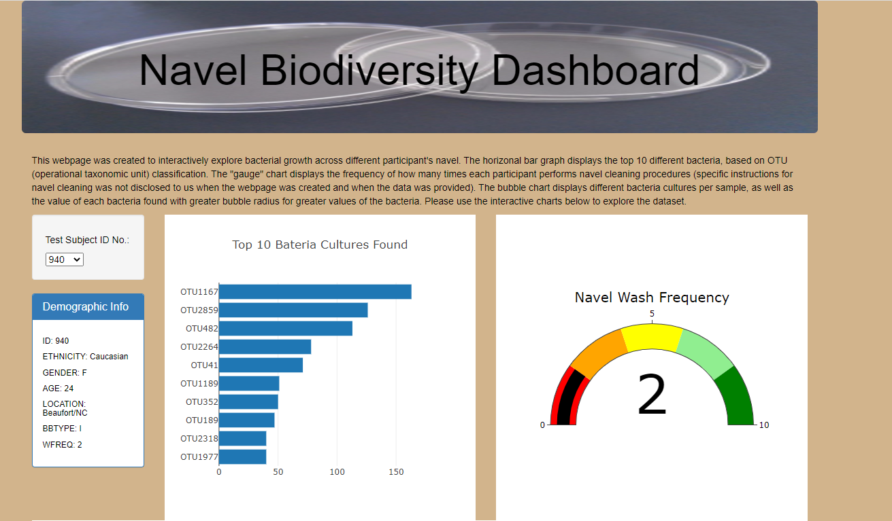
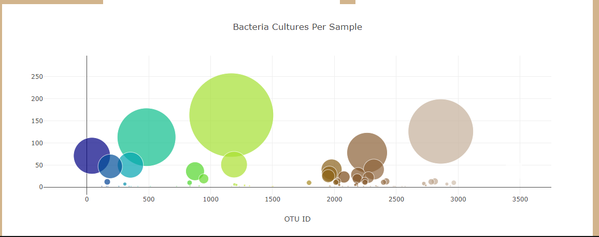
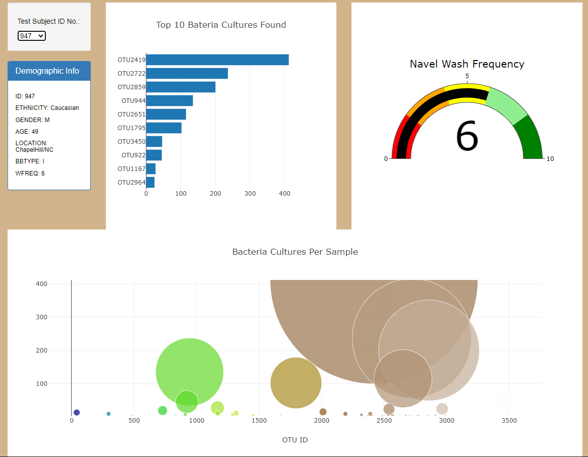

# Navel_Biodiversity_Plotly

## Overview of Project  

**Purpose:**  
The purpose of this project is to create an interactive webpage that allows the user to explore different interactive charts about bacterial growth in participants' navel.  

## Resources:  
- Data Source: Provided [Data](https://github.com/tonywang3571/Navel_Biodiversity_Plotly/blob/master/samples.json)  
- Software: VS code 1.63.2 (Javascript, HTML, CSS, Bootstrap, Plotly)  

## Analysis and Results  

**Analysis:**  
For this project, we used Plotly javascript to create interactive charts from a dataset provided in json format. We extracted specific data needed to build different charts (horizontal bar, gauge, and bubble plot) to allow users to explore. We also created a demographic info table as well as dropdown menu to allow user to select different participant's information and display their results.  

**Results:**  
When a user visits our webpage, they will automatically see the information and results of the first participant. The user may then explore our webpage and charts, and be able to change to different participant's information and display their results. A horizontal bar graph lists the top 10 bacteria OTU (operational taxonomic unit) present for that particular participant. A "gauge" chart, displaying the frequency of navel washing by the participant, though specific naval washing instructions were not provided. A bubble chart was created to display the different bacteria cultures as well as the value of each bacteria per sample found with greater bubble radius for greater values of the bacteria present in the samples.  
  
  
  

## Challenge Summary  

**Summary**  
The purpose of this project is to create an interactive webpage that allows the user to explore different interactive charts of different participants' navel bacteria.  

### Codes Used  
(Please look at specific files for codes used)  
Code for [building data table and charts](https://github.com/tonywang3571/Navel_Biodiversity_Plotly/blob/master/static/js/charts.js)  
Code for [building webpage](https://github.com/tonywang3571/Navel_Biodiversity_Plotly/blob/master/index.html)  
Code for [styling webpage](https://github.com/tonywang3571/Navel_Biodiversity_Plotly/blob/master/static/css/styles.css)  

